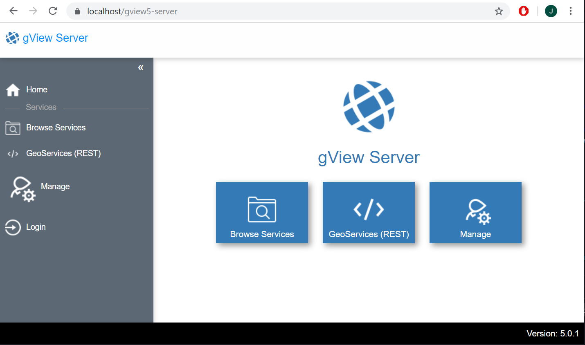

Microsoft Internet Information Server (IIS) (Windows) 
=====================================================

.NET Core Runtime Installieren
------------------------------

gView Server ist eine .NET Core Anwendungen und setzt daher die .NET Core Laufzeitumgebung voraus. 
Diese kann unter folgender Web Seite heruntergeladen werden: 

https://dotnet.microsoft.com/download/dotnet-core

Hier muss die aktuelle Version gewählt werden. Zur Zeit der Erstellung dieser Dokumentation ist die
aktuelle Version unter der gView Server läuft .NET Core 3.0

Hier ist das Runtime & Hosting Bundle zu wählen, damit die Applikation im IIS gehostet werden kann.

Ob nach der Installation alle notwendigen Runtimes am Rechner vorhanden sind, 
kann mit dem Kommandozeilen Tool „dotnet.exe“ überprüft werden. 
(Dieses sollte nach erfolgreicher Installation gefunden werden, wenn alle die PATH Variablen 
richtig gesetzt wurden).

Nach Installation der Runtime & Hosting Bundle sollte 
* Microsoft.AspNetCore.App 
* Microsoft.NETCore.App
in der richtigen Version aufscheinen.

.NET Core Anwendung in IIS einbinden
------------------------------------

Voraussetzung, damit .NET Core Anwendungen im IIS laufen ist das entsprechende Modul 
„AspNetCoreModuleV2“. Dieses Modul steuert die Überwachung und die Weiterleitung der 
Requests vom IIS zur Applikation. Ob dieses Module im obigen Schritt richtig installiert wurde, 
kann über den IIS Manager überprüft werden:

Im nächsten Schritt ist ein Applikation Pool anzulegen:

Wichtig für .NET Core Anwendungen ist, dass als .NET CLR-Version „Kein verwalteter Code“ angeführt wird. 

Im nächsten Schritt muss die Anwendung eingebunden werden. Dazu sollte die Applikation auf deiner Festplatte auf dem Server
vorliegen. Im IIS Manager mit der rechten Maustaste auf die entsprechende WebSite klicken und Anwendung hinzufügen 
auswählen:

Im Anwendung hinzufügen Dialog muss dann noch ein Alias Name vergeben werden. Mit diesem Namen kann man die Applikation später über den Browser aufrufen.
Weiters muss der vorher erstellte Applikation Pool angeführt werden.

Jetzt sollte der gView Server beispielsweise über https://localhost/gview5-server erreichbar sein:

[Weiter..](installation_docker.md)
