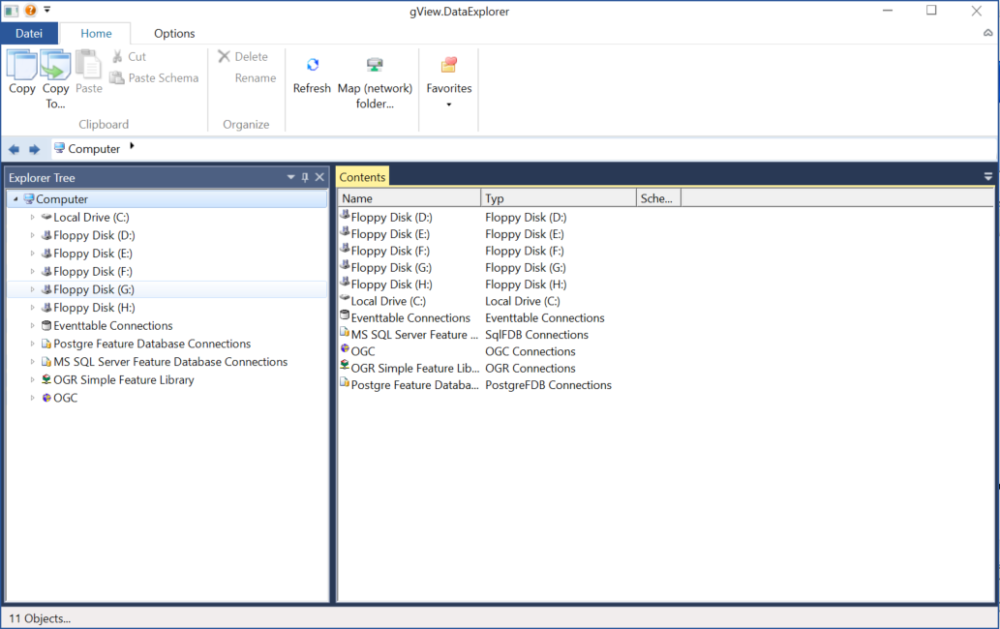

gView Data Explorer
===================

The application is similar to Windows Explorer, but is specifically designed for managing 
geodata. After starting, the following window will appear:

On the left, the file system and the connections to various data sources are displayed as a tree. 
The middle part of the window (*Contents*) always displays the contents of each node.