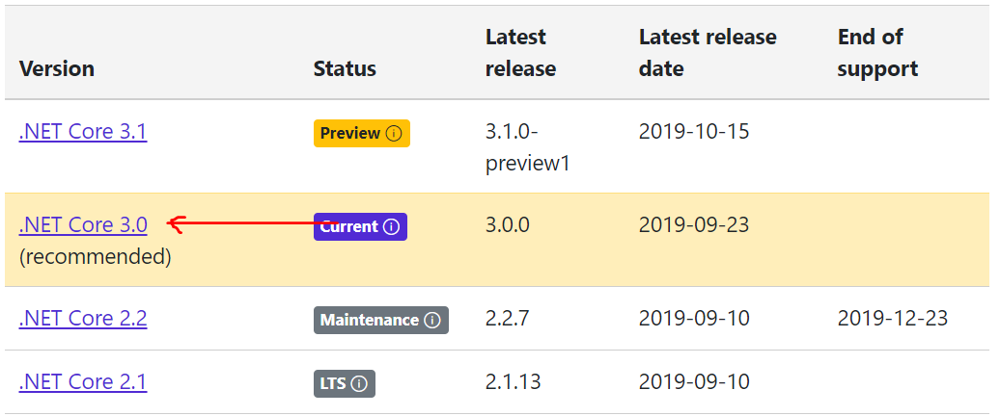
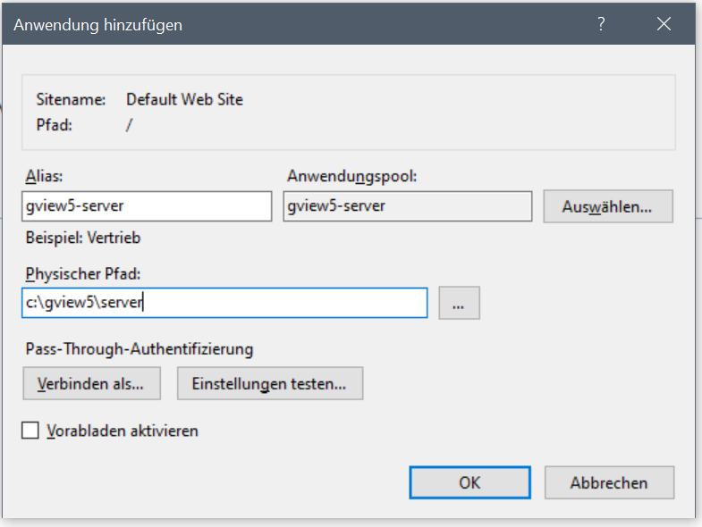

Microsoft Internet Information Server (IIS) (Windows) 
=====================================================

.NET Core Runtime installation
------------------------------

gView Server is a .NET Core application and therefore requires the .NET Core runtime environment. 
This can be downloaded from the following web page: 

https://dotnet.microsoft.com/download/dotnet-core

The current version must be selected here. At the time of the preparation of this documentation, the
current version for the gView server .NET Core 3.0

Here you have to choose the *Runtime & Hosting Bundle* so that the application can be hosted in the IIS.

Whether all necessary runtimes are available on the computer after installation, 
can be checked with the command line tool "dotnet.exe". 
(This should be found after successful installation if all the PATH variables are 
correctly).

After installing the *Runtime & Hosting Bundle* 
* Microsoft.AspNetCore.App 
* Microsoft.NETCore.App
should appear in the correct version. 

Include .NET Core application in IIS
------------------------------------

Prerequisite for .NET Core applications to run in IIS is the module 
"AspNetCoreModuleV2". This module controls the monitoring and forwarding of the 
requests from IIS to the application. Whether this module was installed correctly in the above step, 
can be checked via the IIS Manager:

The next step is to create an application pool:

It is important for .NET Core applications that the .NET CLR version is set to "No Managed Code." 

The next step is to include the application. To do this, the application should be on hard drive on yout the server. 
Right-click the Web Site in IIS Manager and choose *Add application*:

In the *Add application* dialog, an alias name must be choosen. With this name you can call the application later via the browser.
Furthermore, the previously created application pool must be set.

Now, for example, the gView server should be accessible via https://localhost/gview5-server:

[Next..](installation_docker.md)
